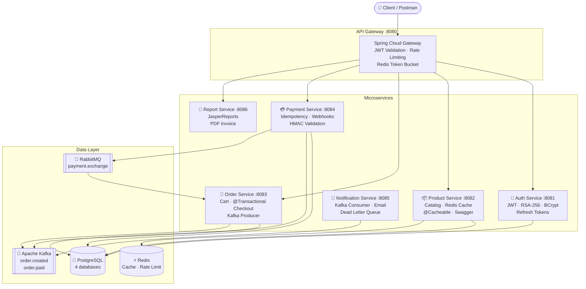
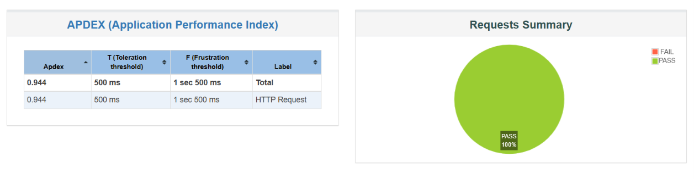
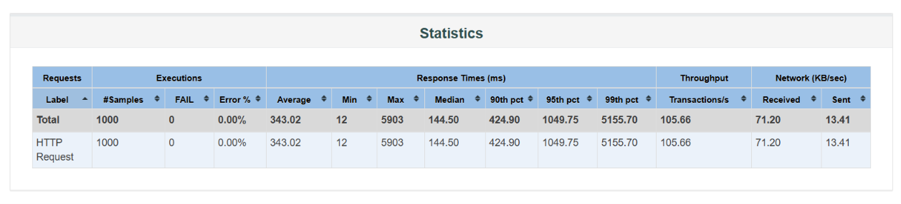
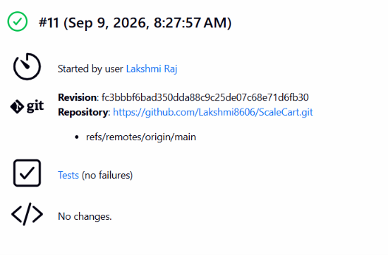
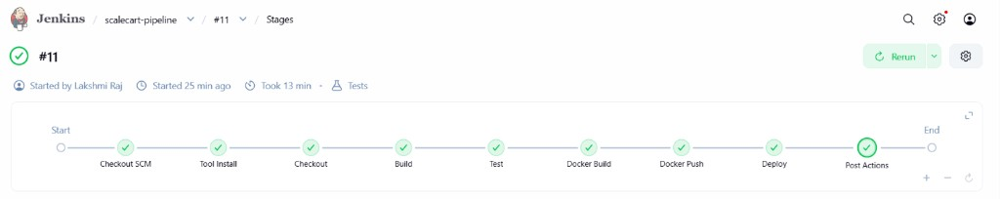
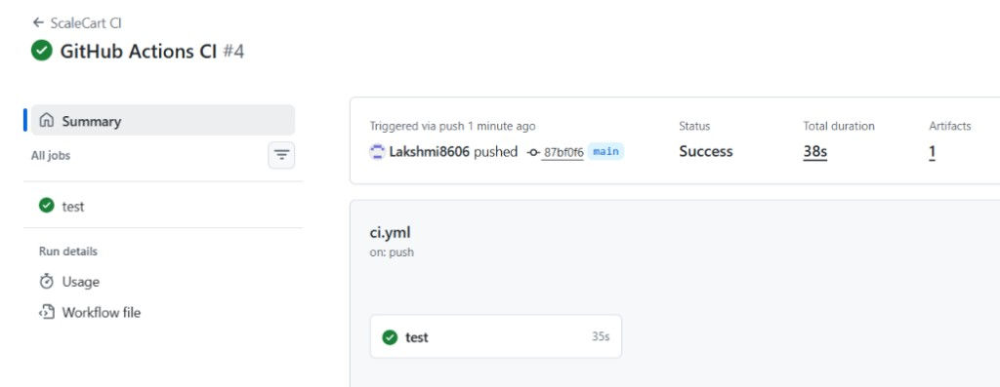
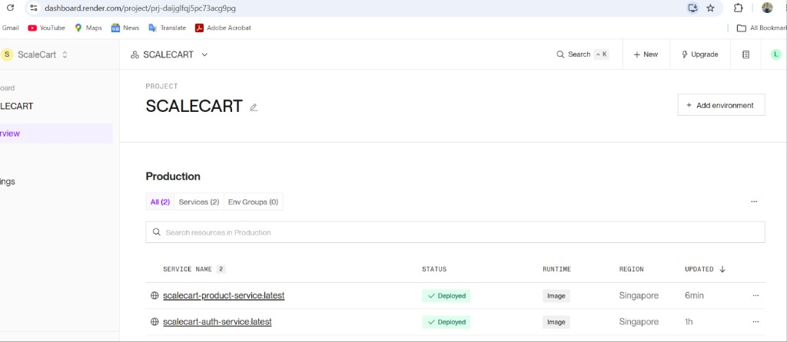

# ScaleCart

A production-grade e-commerce microservices backend built with Java 17, Spring Boot 3.x, PostgreSQL, Redis, Kafka, RabbitMQ, and Docker.

## 🏗️ Architecture

---

## Services

| Service | Port | Responsibility |
|---------|------|----------------|
| api-gateway | 8080 | Single entry point, routes to downstream services |
| auth-service | 8081 | JWT + RSA authentication |
| product-service | 8082 | Product catalog with Redis caching |
| order-service | 8083 | Orders, cart, Kafka + RabbitMQ |
| payment-service | 8084 | Payments with idempotency keys |
| notification-service | 8085 | Async email via Kafka consumer |
| report-service | 8086 | PDF invoice generation |

## Tech Stack

Java 17 | Spring Boot 3.x | PostgreSQL | Redis | Kafka | RabbitMQ | Docker | JMeter | Jenkins | Render | AWS EC2

## Performance

Load-tested with Apache JMeter 5.6.3 (50–100 concurrent users).

- Redis cache: average latency **379 ms → 64 ms** (5.9x), throughput **2.0x**
- Product list API: **100** concurrent users, **500** requests, **0%** errors
- Payment idempotency: **10** concurrent requests, same key, **1** payment created
- APDEX: **0.944 (Excellent)**

Full numbers: [METRICS.md](METRICS.md)

## CI/CD

Jenkins pipeline on `main`: Checkout → Build → Test → Docker Build → Push → Deploy.

- Build **#11** succeeded in **13 minutes**
- Unit tests: **no failures**
- 7 images pushed to Docker Hub (`lakshmidocker9847/scalecart-*:fc3bbbf`)

### GitHub Actions

CI on every push to `main` (run **#4**, **38s**, tests passed).

## Cloud (Render)

Auth and product deployed from Docker Hub. DB is Supabase; cache is Upstash Redis.

| Service | Live URL |
|---------|----------|
| Auth | https://scalecart-auth-service-latest.onrender.com/api/auth/register |
| Product | https://scalecart-product-service-latest.onrender.com/api/products |

- Register (cloud): `201` — User registered successfully
- Product list: **3** items, health **UP**
- Redis: first GET `/api/products/1` **14s** → second **0.74s**

*Render dashboard: scalecart-auth and scalecart-product live in Singapore.*
